# SustainOps — Supplier Sustainability Risk & Compliance Workspace

SustainOps is a polished B2B SaaS prototype for helping procurement, ESG, and compliance teams identify supplier sustainability risk, understand evidence gaps, and drive auditable remediation workflows.

This project is part of my [GitHub product portfolio](https://github.com/sunny-aryan) focused on demonstrating Senior / Principal Technical Product Management thinking through working systems.

Unlike a coding demo, SustainOps is designed to show how complex supplier risk, compliance workflows, AI assistance, deterministic policy rules, role-based experience, and degraded states can be translated into a modern, legible product experience.

---

## Why this project exists

Companies face increasing pressure to understand sustainability and compliance risks across their supplier base. In practice, this work is difficult because supplier data is fragmented, evidence is incomplete, regulations are complex, and procurement teams need clear actions rather than abstract ESG scores.

SustainOps explores the product question:

> How might we help procurement and sustainability teams turn supplier ESG risk into clear, prioritized, auditable action?

The goal is not to build a complete ESG platform. The goal is to demonstrate a credible SaaS workflow for supplier risk review, evidence management, remediation, and trust.

---

## Product thesis

SustainOps helps teams move from:

```text
supplier risk visibility
→ evidence gap understanding
→ compliance readiness context
→ remediation workflow
→ supplier response
→ audit trail
```

The core product principle is:

> AI can summarize and draft. Deterministic rules govern. Humans decide. Audit records.

---

## Target users

| User                     | Primary goal                                                        |
| ------------------------ | ------------------------------------------------------------------- |
| Procurement Manager      | Understand supplier risk exposure and prioritize sourcing follow-up |
| ESG / Compliance Analyst | Review evidence gaps, compliance readiness, and remediation status  |
| Supplier User            | Respond to evidence requests and track remediation milestones       |

The app uses a role selector to demonstrate how the same product can present different context to different users. Full authentication and production RBAC are intentionally out of scope for this prototype.

---

## Core workflows

### 1. Portfolio risk review

Users start from a dashboard showing supplier risk distribution, high/critical suppliers, evidence completion, overdue remediation, and review-required suppliers.

### 2. Supplier discovery and filtering

Users can search and filter suppliers by risk level, category, remediation status, and evidence completeness.

### 3. Dashboard-to-detail investigation

Users can move from portfolio-level signals into supplier-specific detail pages.

### 4. Supplier risk review

Supplier detail pages include overview, evidence review, compliance mapping, remediation workflow, and activity timeline.

### 5. Remediation workflow

Internal users can request evidence, send remediation requests, escalate review, and track workflow status.

### 6. Supplier response

Supplier users can view requested evidence, submit demo responses, and see remediation milestones.

### 7. Trust and methodology review

The Methodology & Trust Center explains risk scoring, evidence completeness, compliance readiness, AI boundaries, deterministic rules, degraded states, and auditability.

---

## Key features

* Polished B2B SaaS layout with onboarding and role-aware navigation
* Supplier portfolio dashboard with deterministic risk indicators
* Realistic 15-supplier mock dataset across countries, categories, and regulatory exposure
* Functional supplier search and filtering
* Dashboard-to-list and dashboard-to-detail flows
* Supplier detail workspace with evidence, compliance, remediation, and activity context
* Bounded remediation workflow with visible blocked states
* Supplier-facing portal for evidence requests and remediation milestones
* Activity timeline for auditability
* Demo controls for degraded states
* AI-unavailable, evidence-source-unavailable, loading, stale-data, and empty states
* Trust Center explaining AI boundaries and deterministic governance

---

## Product walkthrough

### Step 1: Enter the demo workspace

The landing page explains SustainOps and allows the evaluator to enter the workspace using one of three demo roles:

* Procurement Manager
* ESG / Compliance Analyst
* Supplier User

### Step 2: Review portfolio risk

The dashboard answers:

* How many suppliers are monitored?
* How many are high or critical risk?
* Which suppliers require review?
* Where are evidence gaps concentrated?
* Which remediation plans are overdue or escalated?

### Step 3: Filter suppliers

The supplier list supports search and filtering so users can quickly identify suppliers by risk, category, remediation status, or evidence completeness.

### Step 4: Investigate supplier detail

The supplier detail workspace shows why a supplier is risky, which evidence is missing, which compliance frameworks are relevant, and what remediation actions are open.

### Step 5: Drive remediation

The remediation workflow shows requested actions, milestones, blocked approval rules, and supplier response status.

### Step 6: Validate trust boundaries

The Methodology & Trust Center explains how the system separates AI assistance from deterministic governance.

---

## System Architecture

SustainOps is a frontend-only React prototype with local mock data and client-side state.

```text
React / TypeScript / Tailwind / shadcn-style UI
│
├── App shell and navigation
├── Role-aware UI context
├── Supplier portfolio dashboard
├── Supplier list and filters
├── Supplier detail workspace
├── Remediation workflow
├── Supplier portal
├── Demo degraded-state controls
├── Trust Center
│
├── Mock data
│   ├── suppliers
│   ├── evidence records
│   ├── compliance mappings
│   ├── remediation plans
│   └── activity timeline
│
└── Deterministic helpers
    ├── risk scoring
    ├── portfolio stats
    ├── filtering
    ├── blocked-action logic
    └── workflow state rules
```

---

### Mermaid Architecture Diagram

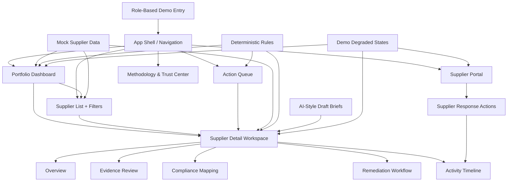

## AI and deterministic boundaries

SustainOps intentionally separates probabilistic and deterministic responsibilities.

| Area               | AI-assisted                 | Deterministic                                  |
| ------------------ | --------------------------- | ---------------------------------------------- |
| Supplier brief     | Summarizes supplier context | Cannot change risk score                       |
| Evidence review    | Highlights missing context  | Evidence status controls readiness             |
| Remediation        | Drafts suggested wording    | Rules govern blocked actions                   |
| Compliance mapping | Explains in plain language  | Readiness status follows policy logic          |
| Workflow           | Suggests next steps         | State transitions and approvals are rule-bound |

AI is intentionally limited to advisory use. It cannot approve suppliers, mark evidence complete, override risk levels, close remediation, or make legal compliance determinations.

---

## Deterministic rules

Example rules used in the prototype:

```text
Risk score >= 90 → Critical risk
Risk score >= 75 → High risk
Evidence completeness < 60% + high criticality → Review required
Missing or expired mandatory evidence → Procurement approval blocked
Supplier submission → Under Review, not Complete
Overdue remediation → Action Queue escalation
Escalated items → ESG / Compliance Analyst review required
```

These rules are simplified for demo purposes but are designed to show how a real product should keep safety, compliance, and workflow state outside of AI judgment.

---

## Empty, loading, error, and degraded states

The prototype includes demo states for:

* AI brief unavailable
* Evidence source unavailable
* Loading supplier analysis
* Stale evidence data
* Empty supplier search results
* Empty action queue
* Role-context mismatch
* Blocked workflow actions

The key product principle is that the system remains useful even when AI or evidence refresh is unavailable. Deterministic risk, evidence, compliance, and workflow controls remain visible.

---

## Data model

The prototype uses realistic mock data for suppliers, evidence, compliance mappings, remediation plans, and activity events.

Example supplier attributes include:

* supplier ID and name
* country and region
* category
* annual spend
* criticality
* risk score and risk level
* evidence completeness
* remediation status
* regulatory exposure
* risk drivers
* required actions
* owner
* next review date

This is synthetic data designed for product realism. No real supplier or customer data is used.

---

## Screenshots

### Demo landing page

The landing page introduces SustainOps and lets evaluators enter the demo workspace using a role-based entry point.

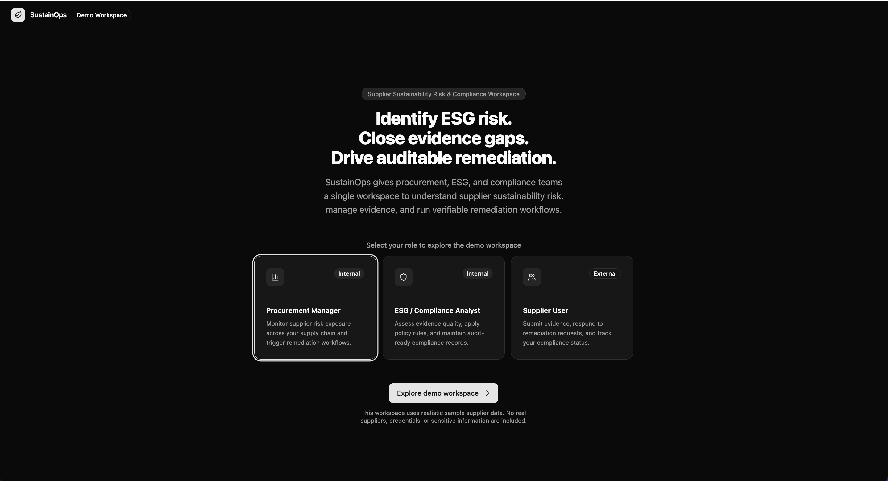

---

### Portfolio risk dashboard

The dashboard helps users quickly understand supplier risk concentration, evidence gaps, overdue remediation, and suppliers requiring review.

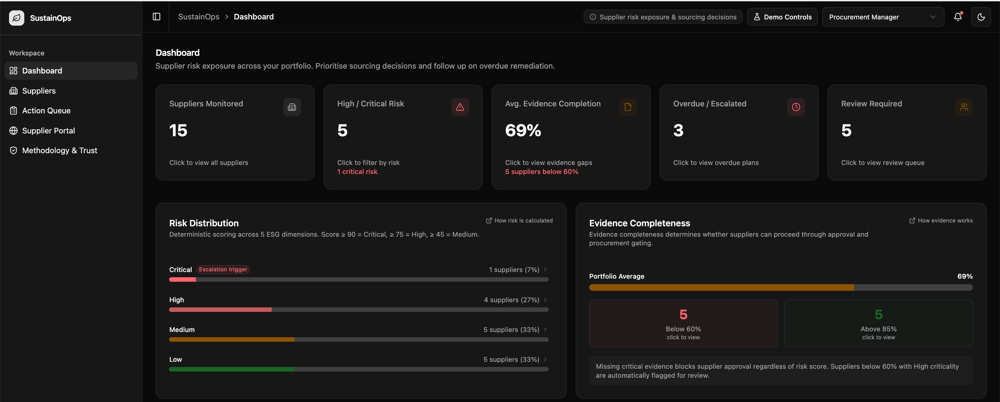
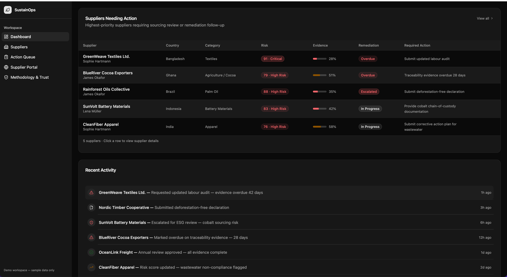

---

### Supplier discovery and filtering

The supplier list supports search and filtering by risk level, category, remediation status, and evidence completeness.

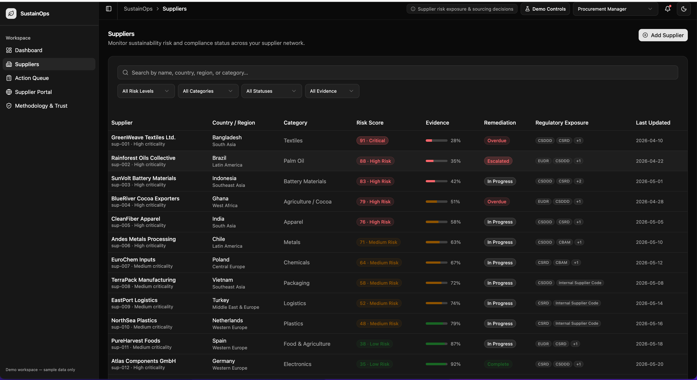

---

### Supplier detail workspace

The supplier detail view shows risk drivers, evidence status, compliance context, remediation workflow, and activity history.

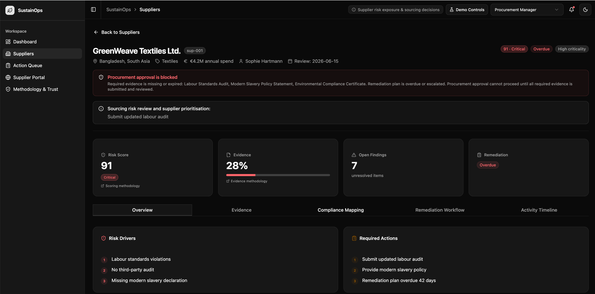
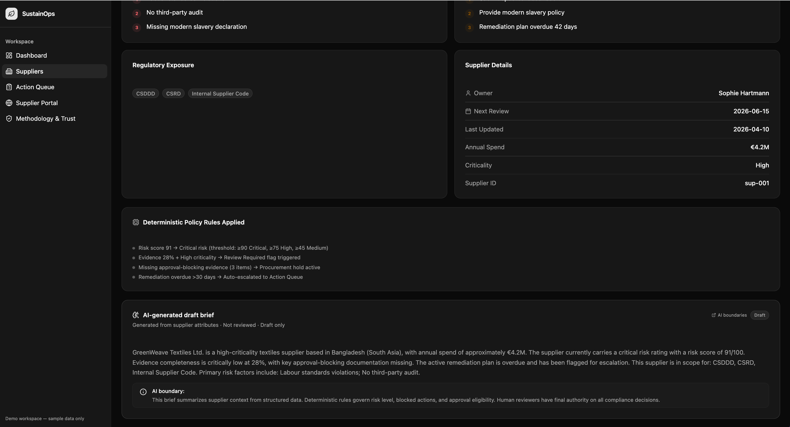

---

### Remediation workflow

The remediation workflow connects supplier risk to evidence requests, blocked approval states, supplier response, and auditability.

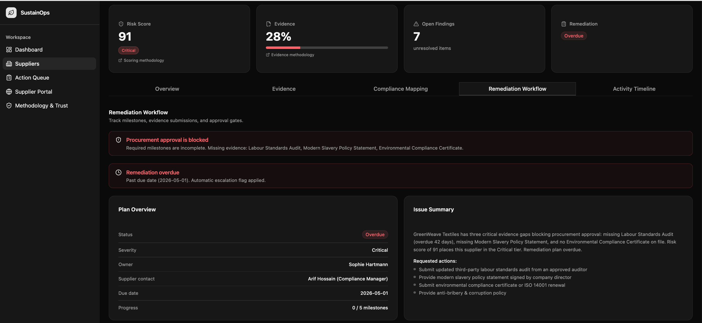
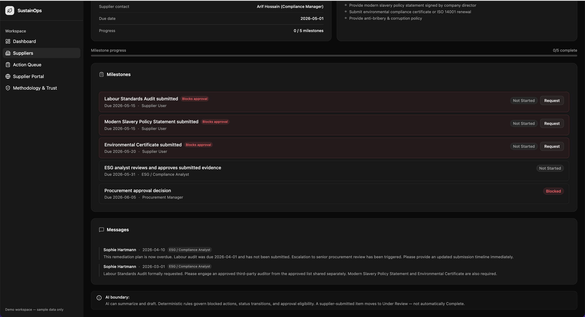

---

### Methodology and Trust Center

The Trust Center explains risk scoring, evidence completeness, deterministic policy rules, AI boundaries, auditability, degraded states, and demo limitations.

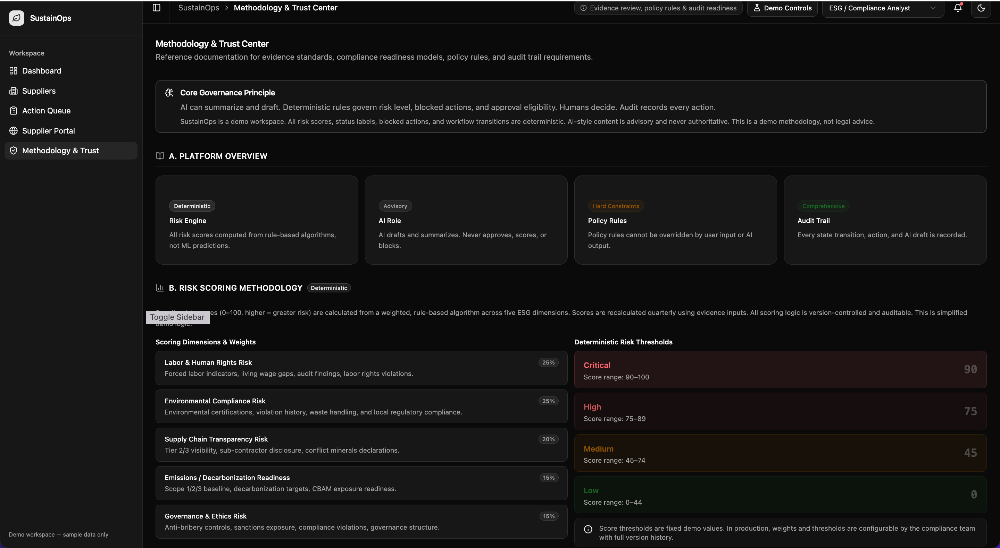
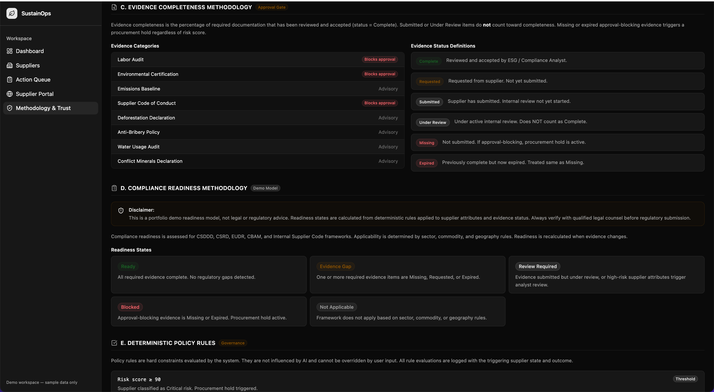
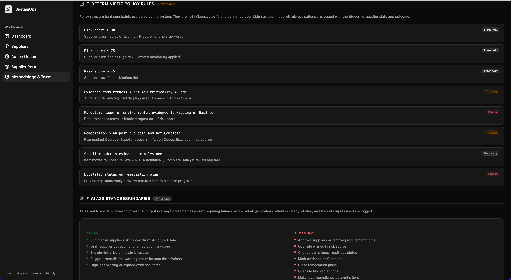
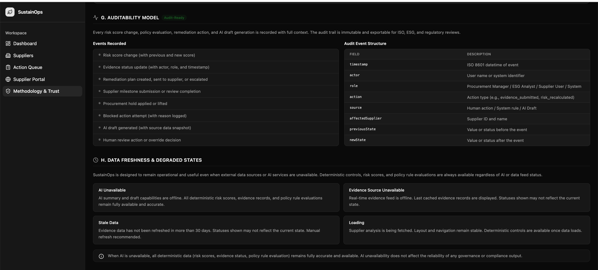


## What this project demonstrates

This project demonstrates:

* Product framing for a complex B2B workflow
* Polished SaaS-grade information architecture
* Role-aware product experience
* Dashboard-to-detail workflow design
* Supplier risk and evidence management
* Human-in-the-loop remediation workflow
* Trust and explainability design
* AI boundary definition
* Deterministic policy and workflow controls
* Empty/loading/error/degraded state handling
* Use of modern AI prototyping tools for frontend acceleration

---

## Progression from previous portfolio projects

This is Project 5 in my product portfolio.

```text
Project 1: Safe Treasury Copilot
→ decision-support system with deterministic safety controls

Project 2: Marketplace Dispute Resolution Copilot
→ operational workflow lifecycle with human review and auditability

Project 3: Travel Disruption Operations Copilot
→ product-grade workflow UX and external dependency realism

Project 4: Billing Recovery Execution Console
→ reliable execution, idempotency, retries, reconciliation, and recovery

Project 5: SustainOps
→ polished SaaS-grade product experience around complex workflows
```

The main improvement in Project 5 is translating system and workflow thinking into a more modern, legible, role-aware SaaS product experience.

---

## Built with ChatGPT + Bolt

This project intentionally used a modern AI prototyping workflow.

* ChatGPT was used for product framing, workflow design, scope control, prompt design, trade-off analysis, documentation structure, and portfolio narrative.
* Bolt was used to accelerate frontend implementation, visual polish, React/TypeScript scaffolding, component creation, and clickable SaaS workflows.
* Local testing and GitHub commits were used to preserve deliberate product iteration rather than one-shot code generation.

The goal was not to let Bolt define the product. The goal was to use Bolt as an implementation accelerator after defining the product direction and workflow structure.

---

## Tech stack

* React
* TypeScript
* Tailwind CSS
* shadcn-style components
* Vite
* Local mock data
* Client-side state

---

## How to run locally

```bash
npm install
npm run dev
```

Then open the local URL shown in the terminal.

For a typical Vite setup, this is usually:

```text
http://localhost:5173
```

---

## Non-goals

This prototype does not include:

* real supplier authentication
* production RBAC
* real document upload
* real OCR or evidence validation
* real AI API calls
* real legal compliance verification
* ERP/procurement integration
* supplier notification channels
* production database
* production audit export

---

## Future improvements

Potential next steps:

* Add production-grade authentication and supplier RBAC
* Add policy versioning and regulatory configuration
* Add document upload and evidence review workflow
* Add OCR and document extraction
* Add supplier notifications via email or Slack
* Add ERP/procurement system integration
* Add audit export for compliance teams
* Add AI evaluation and prompt/version tracking
* Add more robust workflow persistence
* Add executive reporting and trend analysis
